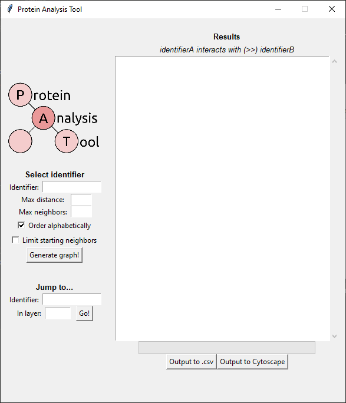

# Protein Analysis Tool: Easily generate graphs of interactions stemming from a protein of your choice.

## Table of Contents:

- [Prerequisites and setup](https://github.com/Craven-Biostat-Lab/SARS-CoV-2-Analysis/tree/main/code/GraphAnalysis#prerequisites-and-setup)
- [Using the tool](https://github.com/Craven-Biostat-Lab/SARS-CoV-2-Analysis/tree/main/code/GraphAnalysis#using-the-tool)
  - [Step one: selecting a protein](https://github.com/Craven-Biostat-Lab/SARS-CoV-2-Analysis/tree/main/code/GraphAnalysis#step-one-selecting-a-protein)
  - [Step two: viewing the results](https://github.com/Craven-Biostat-Lab/SARS-CoV-2-Analysis/tree/main/code/GraphAnalysis#step-two-viewing-results)
  - [Step three: jumping to a specific protein](https://github.com/Craven-Biostat-Lab/SARS-CoV-2-Analysis/tree/main/code/GraphAnalysis#step-three-jumping-to-a-specific-protein)
- [Outputting to `.csv` and Cytoscape](https://github.com/Craven-Biostat-Lab/SARS-CoV-2-Analysis/tree/main/code/GraphAnalysis#outputting-to-csv-and-cytoscape)
  - [Outputting to `.csv`](https://github.com/Craven-Biostat-Lab/SARS-CoV-2-Analysis/tree/main/code/GraphAnalysis#outputting-to-csv)
  - [Outputting to Cytoscape](https://github.com/Craven-Biostat-Lab/SARS-CoV-2-Analysis/tree/main/code/GraphAnalysis#outputting-to-cytoscape)

## Prerequisites and setup

* [Python 3+](https://www.python.org/)
* [Tkinter](https://docs.python.org/3/library/tkinter.html)

Most of this tool only requires Tkinter as an outside prerequisite. To install, run `sudo apt-get install python-tk` from your Linux terminal, or follow [these instructions](https://tkdocs.com/tutorial/install.html) on a different operating system. If you want to port data directly out to Cytoscape, you will need:

* [Cytoscape 3.5+](https://cytoscape.org/)
* [py2cytoscape](https://py2cytoscape.readthedocs.io/en/latest/#installation)
* [requests](https://requests.readthedocs.io/en/master/)
* [json](https://docs.python.org/3/library/json.html)

You can install `py2cytoscape` through a terminal by running `pip install py2cytoscape`, or by following the instructions in the hyperlink above. `json` is probably already installed on your system. To install `requests`, `pip install requests` should do the trick if it isn't already on your machine.

## Using the tool

To start, run `python main.pyw` from this directory, or simply double click the program in your file explorer. After a bit of preparation, this will summon the graphical analysis tool:

### Step one: selecting a protein

First, we must specify a protein to originate as our "home node" within the generated graph. All connections will stem from this original protein, be it proteins with direct connections, or proteins connecting to these connections, and so on.

We first enter the symbol of the protein at hand, which is not case-sensitive. Then, via the `Max distance:` button, we will specify the maximum distance away from our home node. If we specify 2, for example, we will include nodes that are connections of connections of the home node, and nothing further. With `Max neighbors:`, we must also specify how many neighbors are allowed stemming from each node. If a node has more neighbors than the allocated limit, then these connections will not be included in the next layer out. This is to limit growth in our network.

Additionally, there are two checkmarked conditions available: `Order alphabetically`, and `Limit starting neighbors`. The first conditional causes the program to order lines outputted on the right in alphabetical order. The second places the `Max neighbors` limit on the home node, which is normally excluded from such a restriction. By default, the conditionals are enabled and disabled, respectively.

After entering our desired parameters, we can ask the program to generate results with the `Generate graph!` button. In the example above, we're searching for proteins interacting directly with the `aasdhppt` protein. This brings us to step two:

### Step two: viewing results

Results are displayed in the text box to the right. Interactions between two proteins are displayed as `proteinA >> proteinB`, as explained below the header.

Interactions are clustered by layer. First shown are any proteins interacting directly with our targeted protein, followed by connections of these proteins, and so on. Regardless of max distance specified, the program will then search for all SARS-CoV-2 protein interactions with each protein involved in the graph. This is displayed as the final cluster, under the header `## VIRAL INTERACTIONS:`, as below.

"But hey! This is a really long list! What if I want to jump directly to a specific protein in one of the layers?" Well, I'm glad you asked. That brings us to step three:

### Step three: jumping to a specific protein

We can use this last feature to jump to a protein of our choosing. The text box will automatically scroll to wherever the protein is located in the layer specified, and if it can't find the protein at hand, it will say so in a small error message.

## Outputting to `.csv` and Cytoscape

### Outputting to `.csv`

You'll notice a button at the bottom of the interfact that allows you to export data to a `.csv` file. This button does exactly what it does on the tin -- it exports the current state of the **Results** text box to a `.csv` file, where the columns are arranged as in the following example:

| interactorA | interactorB | interactorAType | interactorBType | layer | interactionType |
| ----------- | ----------- | --------------- | --------------- | ----- | --------------- |
| aasdhppt    | traf2       | human           | human           | 1     | human-human     |
| aasdhppt    | usp22       | human           | human           | 1     | human-human     |
| aasdhppt    | babam1      | human           | human           | 1     | human-human     |
| ...         |             |                 |                 |       |                 |
| aasdhppt    | nsp10       | human           | virus           | 4     | human-virus     |
| dld         | nsp12       | human           | virus           | 4     | human-virus     |

Here, `interactorA` and `interactorB` denote the two proteins involved in an interaction; `interactionType` denotes whether that interaction is between a human protein and another human protein, or a human protein and a SARS-CoV-2 protein (the difference between `human-human` and `human-virus`). `interactorAType` and `interactorBType` describe the types of the proteins, and `layer` is how far away `interactorB` is from the head.

### Outputting to Cytoscape

As previously mentioned, this functionality requires [certain prerequisites](https://github.com/Craven-Biostat-Lab/SARS-CoV-2-Analysis/tree/main/code/GraphAnalysis#porting-to-cytoscape), and **you must run Cytoscape in the background for the button to work at all**. With this in mind, the `Output to Cytoscape` is a great way to port your data over to Cytoscape with the simple click of a button.

The program will port each node and edge over one at a time, and will subsequently arrange them in Cytoscape's Circular Layout. You can rearrange or format the graph however you like, and I've found that the yFiles Radial Layout usually does a nice job of showing nodes in relation to their distance from the head node.

**Pro tip!** The import process moves a lot quicker if you don't preview the graph as it's being generated. Deselect the network as it's being imported to vastly increase import speeds.
