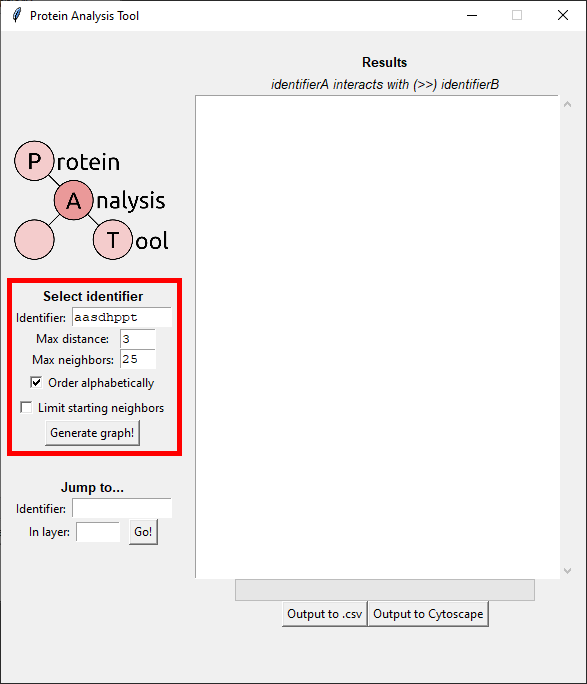

# Protein Analysis Tool 

## Easily generate graphs of interactions stemming from a protein of your choice.

## Prerequisites and setup

* [Python 3+](https://www.python.org/)
* [Tkinter](https://docs.python.org/3/library/tkinter.html)

Most of this tool only requires Tkinter as an outside prerequisite. To install, run `sudo apt-get install python-tk` from your Linux terminal, or follow [these instructions](https://tkdocs.com/tutorial/install.html) on a different operating system.

## Porting to Cytoscape

If you want to port data directly out to Cytoscape, you will need:

* [Cytoscape 3.5+](https://cytoscape.org/)
* [py2cytoscape](https://py2cytoscape.readthedocs.io/en/latest/#installation)
* [requests](https://requests.readthedocs.io/en/master/)
* [json](https://docs.python.org/3/library/json.html)

You can install `py2cytoscape` through a terminal by running `pip install py2cytoscape`, or by following the instructions in the hyperlink above. `json` is probably already installed on your system. To install `requests`, `pip install requests` should do the trick if it isn't already on your machine.

## Using the tool

To start, run `python main.pyw` from this directory, or simply double click the program in your file explorer. After a bit of preparation, this will summon the graphical analysis tool:

### Step one: selecting a protein

First, we must specify a protein to originate as our "home node" within the generated graph. All connections will stem from this original protein, be it proteins with direct connections, or proteins connecting to those connections (a layer 2).

We first enter the symbol of the protein at hand, which is not case-sensitive. Then, we specify max distance away from this protein; as of now, we can only look at 1 or 2 edges away, since anything more than that would take immense computational power to display in Tkinter (greater distances will be possible with a purely terminal-based version of this program for HPC systems). Note that, even with beefier consumer computers, a max distance of 2 will take a few minutes to compute, and will seemingly freeze the window. Do not close the program during this time.

We can specify if we'd like the results sorted alphabetically, before finally asking the program to generate results with the `"Generate graph!"` button.

In the example above, we're searching for proteins interacting directly with the `mov10` protein. We check that we want these results sorted alphabetically. This brings us to step two:

### Step two: viewing results

Results are displayed in the text box to the right. Interactions between two proteins are displayed as `proteinA >> proteinB`, as explained below the header. 

Interactions are clustered by layer. First shown are any proteins interacting directly with our targeted protein. If max distance is set to 2, it will then list all interactions branching out from this first layer of connections as a second layer.

Regardless of max distance specified, the program will then search for all viral interactions with each protein involved in the graph. This is displayed as the final cluster, under the header `## VIRAL INTERACTIONS:`, as below.

"But hey! This is a really long list! What if I want to jump directly to a specific protein in one of the layers?" Well, I'm glad you asked. That brings us to step three:

### Step three: jumping to a specific protein

We can use this last feature to jump to a protein of our choosing. The text box will automatically scroll to wherever the protein is located in the layer specified, and if it can't find the protein at hand, it will say so in a small error message.

## Outputting to `.csv` and Cytoscape

### Outputting to `.csv`

You'll notice a button at the bottom of the interfact that allows you to export data to a `.csv` file. This button does exactly what it does on the tin -- it exports the current state of the **Results** text box to a `.csv` file, where the columns are arranged as in the following example:

| interactorA | interactorB | interactionType |
| ----------- | ----------- | --------------- |
| mov10       | puf60       | human-human     |
| mov10       | hnrnpa1     | human-human     |
| mov10       | khdrbs2     | human-human     |
| mov10       | pms1        | human-human     |
| mov10       | mrpl58      | human-human     |

Here, `interactorA` and `interactorB` denote the two proteins involved in an interaction; `interactionType` denotes whether that interaction is between a human protein and another human protein, or a human protein and a SARS-CoV-2 protein (the difference between `human-human` and `human-virus`). 

### Outputting to Cytoscape

As previously mentioned, this functionality requires [certain prerequisites](https://github.com/Craven-Biostat-Lab/SARS-CoV-2-Analysis/tree/main/code/GraphAnalysis#porting-to-cytoscape), and **you must run Cytoscape in the background for the button to work at all**. That being said, the networks generated by this tool are still titanic in size, causing horrible stress upon consumer PCs if you choose to attempt it. A one-layer graph probably won't cause too much trouble, but once you approach the hundreds of thousands of edges in a two-layer graph, Cytoscape will take a very long time to generate.

We can consider this exporting to Cytoscape as a sort of "beta" feature for now; I still need to figure out how to format the Cytoscape visualization so that displays as a pretty tree rather than an indecipherable blob.