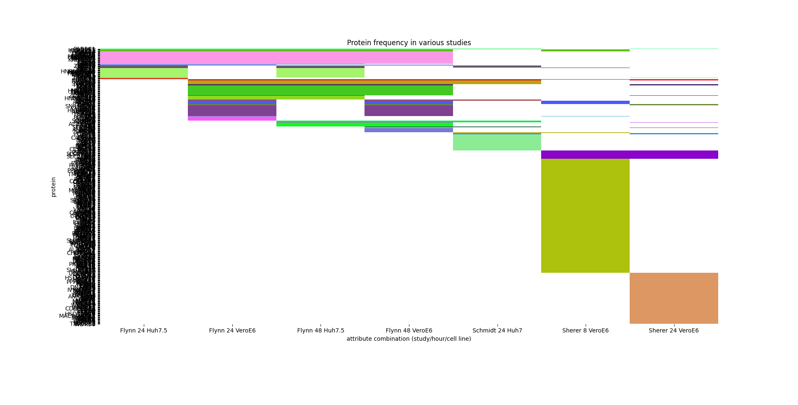

# Heatmapping the data

## Prerequisites and setup

* [Python 3+](https://www.python.org/)
* [pandas](https://pandas.pydata.org/)
* [Matplotlib](https://matplotlib.org/)
* [Seaborn](https://seaborn.pydata.org/)
* [NumPy](https://numpy.org/)

The Python prerequisites can be easily installed by running `./setup.sh` in this directory. If they are already present on your machine, they will not be installed again. Alternatively, if bash isn't working on your machine, you could simply copy and paste the pip3 commands found in `setup.sh` into your terminal.

## Using the tool

To start, run `python Heatmap.py` from this directory.

At first, proteins are tightly bunched on the y-axis, to the point that they are essentially indecipherable:

To un-bunch these proteins, and view a thin "slice" of the heatmap, select the magnifying glass at the bottom of the interface, and draw a thin box over a section of the graph:

At this point, we can select the panning tool to move up and down the graph, revealing more clusters. (Hint: hold down Y to lock panning to the y-axis; this is bugged with trackpads, it seems).

Ultimately, we can return to the initial zoom level by hitting the home button (outlined in red). We can also save the current view as an image file using the save button (outlined in blue).

## Understanding the heatmap

Proteins are organized in the heatmap in a cluster structure. Each cluster has a unique color, and is matched by the exact attribute combinations (ACs) the proteins are detected in. For example:

Here, `TRA2B` and `RRBP1` hold the same three ACs: `Flynn 24 Huh7.5`, `Flynn 24 VeroE6` and `Flynn 48 Huh7.5`. An AC holds the study, time stamp and cell line each protein is detected in, respectively, so both of these proteins were found in the Flynn study, at 24 and 48 hour periods, and within the Huh7.5 and VeroE6 cell lines.

## How clusters are arranged

There are 2^n possible sets of ACs a protein could have, where n is the number of ACs; in other words, the sum of row n of Pascal's Triangle. Assuming `1` denotes the presence of an AC, a protein could either match every possible AC (`[1, 1, 1, 1, 1, 1, 1]`) or none at all (`[0, 0, 0, 0, 0, 0, 0]`), and everything in between. Now, if we consider these sequences of 0s and 1s as binary values, clusters are arranged by the decimal translation of these sequences, with `0b1111111 = 127` at the top, and `0b0000000 = 0` at the bottom.

If we were interested in looking at all proteins found at ACs `Flynn 24 Huh7.5`, `Flynn 48 Huh7.5`, and `Sherer 8 VeroE6` (columns 1, 3, and 6), this would translate to a sequence of `0b1010010`, or 82 in decimal. Out of the 127 possible clusters, this would place it closer to the top. As it turns out, that's exactly where it is:

The only matched protein to this cluster is `RPL15`.